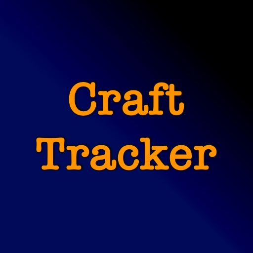

# Craft Tracker

## Overview

**Iron Hells** is a Minecraft mod made for [Minecraft Forge](https://minecraftforge.net).

* Add items to a queue to keep track of what you need
* Setup a shopping list so you know what to gather

## Requirements

* [JEI](https://www.curseforge.com/minecraft/mc-mods/jei)

## Where To Get It

Download it from [CurseForge](https://www.curseforge.com/minecraft/mc-mods/iron-hells) or [Modrinth](https://modrinth.com/mod/iron-hells).

## Translations

If you would like to help translate Craft Tracker into your language, please open [an issue](https://github.com/actions/setup-java/issues).
